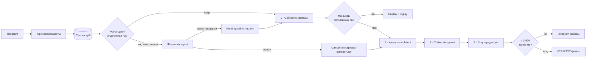

<h1 align="center">Қазақша промпт құрастыру боты</h1>

<p align="center">
  <strong>Telegram-дағы қарапайым сұрауды қазіргі қазақ тіліндегі нақты әрі жалпы мақсаттағы AI құралына көшіруге дайын промптқа айналдыратын күй сақтайтын n8n жұмыс процесі.</strong>
</p>

<p align="center">
  <a href="README.md">English</a> · <a href="README.kk.md"><strong>Қазақша</strong></a>
</p>

<p align="center">
  <a href="https://n8n.io/"></a>
  
  
  <a href="LICENSE"></a>
</p>

Бот пайдаланушының тапсырмасын орындамайды. Ол тапсырманы **жақсырақ промптқа айналдырады**: алдымен сұрауды ойдан дерек қоспай картаға түсіреді, жетіспейтін мәлімет шынымен маңызды болса ғана нақты сұрақ қояды, содан кейін дербес қазақша промптты құрастырып, тексеріп, соңғы редакциядан өткізеді.

Импортталатын жұмыс процесінің өзі — негізгі өнім. Ол әдепкіде белсенді емес, credential сілтемелері placeholder мәндермен ауыстырылған, community node немесе сыртқы дерекқорды қажет етпейді.

## Нақты жұмыс барысы

<table>
  <tr>
    <td width="50%" align="center">
      <a href="docs/assets/telegram-request-processing.png"></a>
    </td>
    <td width="50%" align="center">
      <a href="docs/assets/telegram-clarification-resume.png"></a>
    </td>
  </tr>
  <tr>
    <td align="center"><strong>1 · Қабылдау және қалыпқа келтіру</strong><br><sub>Сұрау тексеріліп, уақытша өңдеу хабары шығады.</sub></td>
    <td align="center"><strong>2 · Қажет кезде ғана нақтылау</strong><br><sub>Келесі Telegram хабары сақталған сұрауды жалғастырады.</sub></td>
  </tr>
</table>

<p align="center">
  <a href="docs/assets/telegram-prompt-file-delivery.png"></a><br>
  <sub><strong>3 · Көшіруге дайын нәтиже.</strong> 3 600 таңбадан ұзын промпт UTF-8 мәтіндік файлымен жіберіледі.</sub>
</p>

[Пайдаланушы жолын толық көру →](docs/user-flow.md) (ағылшынша)

## Неліктен бұл жай LLM байланысы емес

| Шешім | Жұмыс процесіндегі нақты әрекет |
| --- | --- |
| **Құрастырудан бұрын бейнелеу** | Mapper мақсатты, фактілерді, шектеулерді, өзгермеуге тиіс тұстарды, екіұштылықтарды және қауіпті болжамдарды JSON картаға түсіреді; тапсырманың өзін орындамайды. |
| **Шектелген диалог күйі** | Telegram chat/user/topic контексіне бір pending нақтылау сақталады: бір айналым, ең көбі екі сұрақ, 30 минут логикалық жарамдылық. |
| **Бастапқы ниетті бөлек тексеру** | Kazakh Prompt Architect жоба жасайды, Prompt Fidelity Auditor оны бастапқы сұраумен салыстырады, Final Prompt Editor орынды түзетулерді қолданады. |
| **Сақ маршруттау** | Classifier келесі хабардың жауап не жаңа тапсырма екенін ажыратады. Күмәнді не оқылмайтын жауаптар бір-біріне қате жалғанбайды. |
| **Ашық fallback тәртібі** | Mapper қатесі бастапқы сұрауға, auditor қатесі «өзгеріс жоқ» күйіне, соңғы editor қатесі architect жобасына қайтады. |
| **Telegram-ға бейімделген нәтиже** | Жарамсыз мәтін AI шақырылмай тұрып тоқтайды; status тазалануы best effort; ұзын промпт `.txt` болып жіберіледі. |

## Архитектура



Нақтылауды күту бір ұзақ execution ішінде жүрмейді. Күй n8n Data Table-ға жазылады; кейін келген Telegram update жаңа execution бастап, сессия кілті арқылы бұрынғы сұрауға қайта қосылады.

<p align="center">
  <a href="docs/assets/n8n-workflow-overview.png"></a><br>
  <sub>53 түйіннен тұратын толық canvas. Үлкейту үшін суретті ашыңыз.</sub>
</p>

Барлық маршрут, күй ауысуы және fallback: [архитектура анықтамасы](docs/architecture.md) (ағылшынша).

## Өз инстансыңызда іске қосу

### Қажеттілер

- экспорттағы node нұсқаларын, соның ішінде Data Tables пен OpenAI model-response операциясын танитын n8n инстансы;
- Telegram бот токені және n8n-ге жететін ашық HTTPS webhook;
- экспортта таңдалған `gpt-5.6-terra` және `gpt-5.6-sol` модельдеріне рұқсаты бар OpenAI API credential-ы.

### Импорт

1. [`workflow/kazakh-prompt-engineering-bot.json`](workflow/kazakh-prompt-engineering-bot.json) файлын жүктеңіз.
2. n8n ішінде **Import from File** таңдаңыз.
3. Telegram credential-ыңызды trigger және Telegram action түйіндеріне бекітіңіз.
4. OpenAI credential-ыңызды бес OpenAI түйініне бекітіп, екі модельдің қолжетімді екенін тексеріңіз.
5. Жұмыс процесін сақтап, белсендіріңіз де, ботқа мәтіндік тапсырма жіберіңіз.

Алғашқы update келгенде `prompt_clarification_sessions` кестесі жасалады. Ашық экспорттағы credential ID мен атауларының бәрі placeholder.

Егер модельдердің бірі тіркелгіңізге қолжетімсіз болса, тиісті түйіндерден балама модель таңдай аласыз. Бірақ бұл JSON пішіміне сәйкестікті, нақтылау жиілігін, кідірісті, шығынды және қазақша сапаны өзгертуі мүмкін, сондықтан толық жолды қайта тексеріңіз.

Telegram рұқсаттары, webhook ерекшеліктері және тексеру матрицасы: [орнату нұсқаулығы](docs/setup.md) (ағылшынша).

## Нақты шекаралар

| Бар мүмкіндік | Жоқ мүмкіндік |
| --- | --- |
| Telegram мәтіні және media caption | Дауыс/аудио транскрипциясы немесе медиа мазмұнын түсіну |
| Еркін мәтіндік сұраулар | Арнайы `/start` onboarding немесе басқа bot command өңдеуі |
| Бір маңызды нақтылау айналымы | Көп айналымды диалог немесе form үлгісіндегі жауап талдауы |
| Chat/user/topic бойынша pending күй | Аяқталған сұраулардың толық idempotency-і немесе транзакциялық lock |
| Model/Telegram retry және нүктелік fallback | Жалпы error workflow, alert немесе мониторинг |
| Промпт деңгейіндегі untrusted-content нұсқаулары | Security sandbox, moderation немесе prompt-injection кепілдігі |
| n8n ішіндегі оқиғаға тәуелді тазалау | Дәл уақыттағы scheduled deletion, сыртқы сақтау немесе zero-retention кепілдігі |

Әдеттегі аяқталған сұрау OpenAI API-ын төрт рет шақырады. Экспортта allowlist, quota, rate limit, budget guard, benchmark немесе performance target жоқ. Telegram мәтіні мен идентификаторлары n8n және OpenAI арқылы өтеді; n8n execution retention нақтылау кестесін тазалаудан бөлек басқарылады.

Ботты көпшілікке ашпас бұрын [құпиялық және қауіпсіздік](docs/privacy-and-security.md) құжатын оқыңыз (ағылшынша).

## Репозиторийді тексеру

```bash
npm test
```

Dependency қажет етпейтін validator workflow графын, архитектуралық түйіндерді, құжатталған тұрақтыларды, placeholder credential-дарды, репозиторий тазалығын, жергілікті сілтемелерді, визуалдарды және кең таралған құпия кілт үлгілерін тексереді. Ол желіге қосылмайды және live n8n, Telegram немесе OpenAI интеграциясын тексермейді.

## Құжаттар

Төмендегі техникалық құжаттар ағылшын тілінде жазылған.

| Құжат | Мақсаты |
| --- | --- |
| [Орнату және бейімдеу](docs/setup.md) | Импорт, credential, тексеру, ақауды іздеу және модель ауыстыру. |
| [Пайдаланушы жолы](docs/user-flow.md) | Скриншоттардағы Telegram тәжірибесін қадаммен көру (ағылшынша). |
| [Архитектура](docs/architecture.md) | Маршрут, күй, AI келісімшарттары, retry және fallback. |
| [Құпиялық және қауіпсіздік](docs/privacy-and-security.md) | Дерек ағымы, сақтау, trust boundary және deployment тәуекелдері. |
| [Үлес қосу](CONTRIBUTING.md) | Сілтемелерді бұзбай және дерек таратпай workflow-ды өзгерту. |

## Лицензия

[MIT](LICENSE). n8n, Telegram, OpenAI сервистері мен олардың шарттары бұл репозиторийден бөлек.
