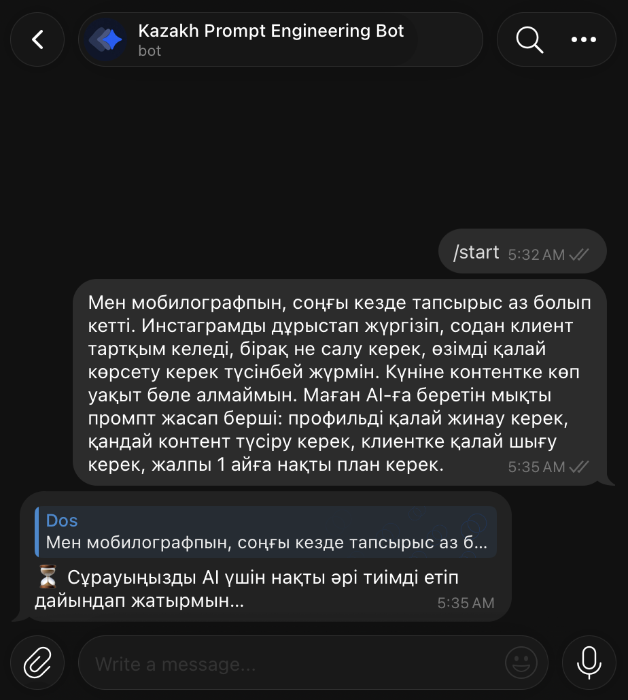
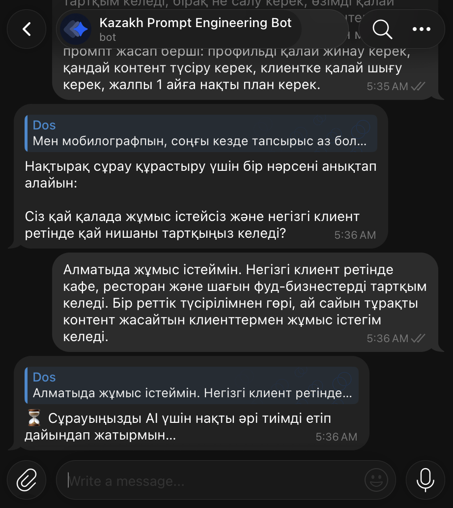
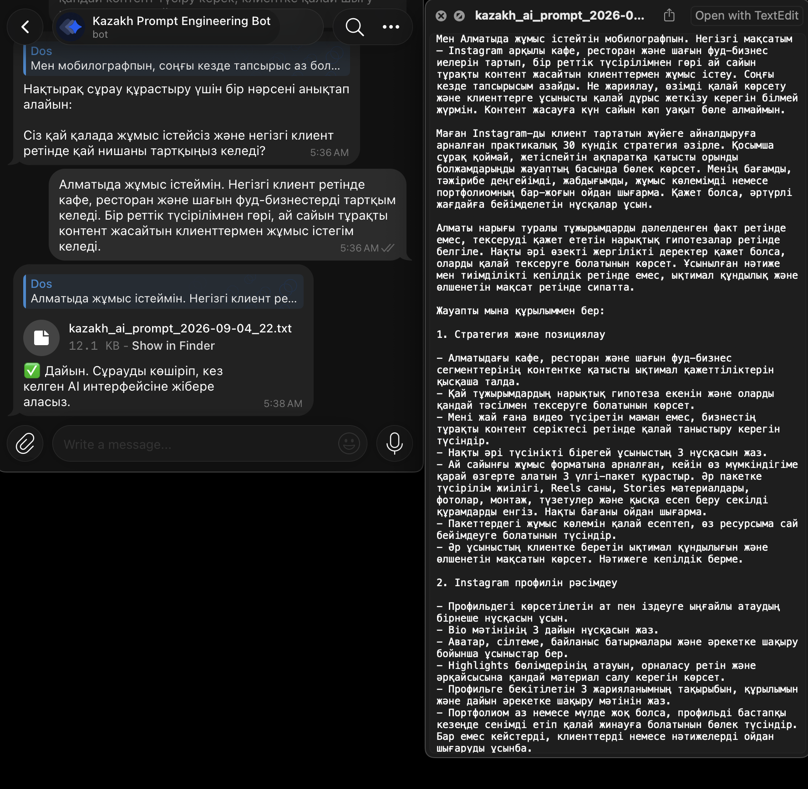
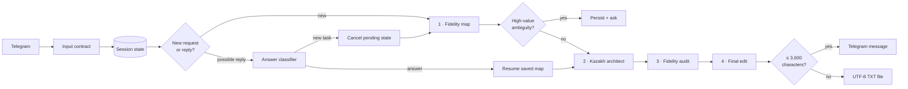
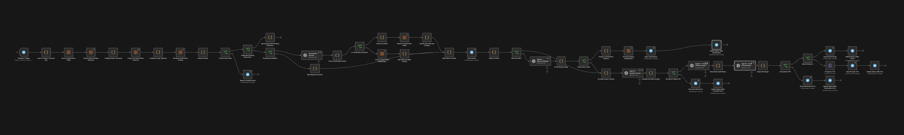

<h1 align="center">Kazakh Prompt Engineering Bot</h1>

<p align="center">
  <strong>A stateful n8n workflow that turns an ordinary Telegram request into a precise, portable prompt in modern Kazakh.</strong>
</p>

<p align="center">
  <a href="README.md"><strong>English</strong></a> · <a href="README.kk.md">Қазақша</a>
</p>

<p align="center">
  <a href="https://n8n.io/"></a>
  
  
  <a href="LICENSE"></a>
</p>

The bot does not perform the user's task. It **compiles the task into a better prompt**: first mapping the request without inventing facts, then asking a focused question only when the missing information matters, and finally drafting, auditing, and editing a standalone Kazakh prompt for use with a general-purpose AI.

The importable workflow is the product. It is inactive by default, contains placeholder credential references, and requires no community nodes or external database.

## See it work

<table>
  <tr>
    <td width="50%" align="center">
      <a href="docs/assets/telegram-request-processing.png"></a>
    </td>
    <td width="50%" align="center">
      <a href="docs/assets/telegram-clarification-resume.png"></a>
    </td>
  </tr>
  <tr>
    <td align="center"><strong>1 · Accept and normalize</strong><br><sub>The bot validates the request and posts a temporary status.</sub></td>
    <td align="center"><strong>2 · Clarify only when useful</strong><br><sub>A later Telegram message resumes the stored request.</sub></td>
  </tr>
</table>

<p align="center">
  <a href="docs/assets/telegram-prompt-file-delivery.png"></a><br>
  <sub><strong>3 · Deliver a copy-ready result.</strong> Prompts over 3,600 characters are sent as UTF-8 text files.</sub>
</p>

[Open the complete user-flow walkthrough →](docs/user-flow.md)

## What makes it more than an LLM relay

| Design choice | What the workflow actually does |
| --- | --- |
| **Representation before generation** | A mapper produces an evidence-bound JSON fidelity map—facts, constraints, invariants, ambiguities, and unsafe assumptions—without solving the task. |
| **Bounded conversational state** | One pending clarification is stored per Telegram chat/user/topic context, with one round, up to two questions, and a 30-minute logical expiry. |
| **Intent-preserving review** | A Kazakh prompt architect writes the draft, a separate auditor checks it against the original request, and a final editor applies valid repairs. |
| **Conservative routing** | A classifier decides whether the next message answers a pending question. Uncertain or unparsable classifications start a new request rather than merging unrelated content. |
| **Explicit degradation** | Mapper failure falls back to the original request, auditor failure becomes “no changes,” and final-editor failure falls back to the architect draft. |
| **Telegram-aware delivery** | Invalid text is rejected before model use; status cleanup is best effort; long prompts become `.txt` attachments. |

## Architecture



The clarification wait is not a long-running execution. State is written to the native n8n Data Table, and a later Telegram update starts a new execution that reconnects through the session key.

<p align="center">
  <a href="docs/assets/n8n-workflow-overview.png"></a><br>
  <sub>The complete 53-node canvas. Open the image for the full-size view.</sub>
</p>

The [architecture reference](docs/architecture.md) traces every route, parser fallback, state transition, retry, and delivery branch.

## Run your own instance

### Prerequisites

- an n8n instance that recognizes the node versions in the export, including Data Tables and the OpenAI model-response operation;
- a Telegram bot token and a public HTTPS webhook route to n8n;
- an OpenAI API credential with access to the configured model IDs: `gpt-5.6-terra` and `gpt-5.6-sol`.

### Import

1. Download [`workflow/kazakh-prompt-engineering-bot.json`](workflow/kazakh-prompt-engineering-bot.json).
2. In n8n, choose **Import from File**.
3. Assign your Telegram credential to the trigger and Telegram action nodes.
4. Assign your OpenAI credential to all five OpenAI nodes and confirm both configured models are available.
5. Save and activate the workflow, then send the bot a text request.

On the first incoming update, the workflow creates `prompt_clarification_sessions`. All credential IDs and names in the public export are placeholders.

If either model is unavailable to your account, you can select substitutes in the affected nodes, but model changes can alter structured-output compliance, clarification behavior, latency, cost, and Kazakh quality. Test the complete path after adapting it.

Follow the [setup and verification guide](docs/setup.md) for Telegram permissions, webhook caveats, credential-node names, an adoption test matrix, and troubleshooting.

## Implemented boundaries

| The workflow supports | It does not implement |
| --- | --- |
| Telegram text and media captions | Voice/audio transcription or media understanding |
| Free-form requests | Dedicated `/start` onboarding or other bot-command handling |
| One high-value clarification round | Multi-round conversation or form-style answer parsing |
| Per-chat/user/topic pending state | Durable idempotency after completion or transactional locking |
| Model/Telegram send retries and targeted fallbacks | A global error workflow, alerting, or monitoring |
| Prompt-level untrusted-content instructions | A security sandbox, moderation layer, or prompt-injection guarantee |
| Native n8n state with event-driven cleanup | Immediate scheduled deletion, external storage, or zero-retention guarantees |

A typical completed request makes four OpenAI calls. There is no access allowlist, quota, rate limit, budget guard, benchmark, or performance target in the export. Telegram content and identifiers pass through n8n and OpenAI; n8n execution retention is separate from the workflow's clarification-table cleanup.

Read [privacy and security](docs/privacy-and-security.md) before making the bot publicly reachable.

## Repository checks

```bash
npm test
```

The dependency-free validator checks the workflow graph, architectural anchors, documented constants, credential placeholders, repository cleanliness, local documentation links, required visuals, and common secret patterns. It makes no network calls and does not test a live n8n, Telegram, or OpenAI integration.

## Documentation

| Document | Use it to… |
| --- | --- |
| [Setup and adaptation](docs/setup.md) | Import, configure, test, troubleshoot, and change models safely. |
| [User flow](docs/user-flow.md) | Walk through the Telegram experience shown in the screenshots. |
| [Architecture](docs/architecture.md) | Inspect routing, state, AI-stage contracts, retries, and fallbacks. |
| [Privacy and security](docs/privacy-and-security.md) | Understand data flow, retention, trust boundaries, and deployment gaps. |
| [Contributing](CONTRIBUTING.md) | Change and re-export the workflow without breaking references or leaking data. |

## License

[MIT](LICENSE). n8n, Telegram, OpenAI, and their respective service terms are separate from this repository.
