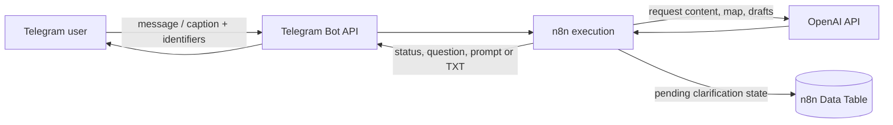

# Privacy and security

[Home](../README.md) · [Setup](setup.md) · [User flow](user-flow.md) · [Architecture](architecture.md)

This workflow handles user-authored content and Telegram identifiers across three systems. Read this before exposing the bot beyond a controlled test audience.

## Data flow



The workflow sends the following kinds of data to OpenAI, depending on the path:

- the original Telegram text or caption;
- the request fidelity map;
- clarification questions and the user's answer;
- the engineered prompt and audit memo.

OpenAI nodes are configured with `store: false`. Do not interpret that setting as a complete retention guarantee across n8n execution storage, network/infrastructure logs, provider abuse monitoring, or Telegram.

## Data stored in n8n

The Data Table persists `session_key`, Telegram chat/user/thread identifiers, the original request, the structured request map, clarification questions and answers, status, and timestamps.

Pending state is logically valid for 30 minutes. Resolved, cancelled, and expired rows are eligible for deletion seven days after their last update. Both expiry marking and deletion run only when another Telegram update starts the workflow, so an idle deployment may retain rows beyond those wall-clock intervals.

n8n may separately retain full execution inputs and outputs according to the instance's execution-data settings. That can include more than the clarification table. Configure retention, pruning, access controls, backups, and log redaction for your deployment; the workflow export does not do so.

## Secrets in this repository

The canonical JSON references only placeholder credential IDs and names. It contains no Telegram bot token or OpenAI API key. n8n credentials should be created inside the target instance and must never be pasted into the workflow JSON, issue reports, screenshots, or execution samples.

Before publishing a modified export, run:

```bash
npm test
```

The repository validator detects common token/key and absolute local-path shapes, rejects non-placeholder workflow credentials, checks local links, and blocks common OS artifacts. This is a useful guardrail, not a comprehensive secret scanner.

If a real secret is committed, revoke/rotate it first; deleting it from the latest commit does not remove it from Git history or forks.

## Trust boundaries and prompt injection

Every AI system message labels interpolated user content and earlier generated artifacts as untrusted. This reduces the chance that text inside a request can redefine a pipeline role. The workflow also uses narrow output contracts, separate auditing, and parser defaults that fail away from attaching uncertain messages to pending requests.

These controls do not create a hard sandbox. Model outputs remain probabilistic, and the final product is itself text intended for another AI. Do not use the bot's output as trusted code, legal advice, security policy, or an authorization decision without appropriate review.

The workflow does not invoke tools, browse the web, execute generated code, or access user files. Its n8n Code nodes execute fixed JavaScript included in the workflow; they do not evaluate the Telegram message as JavaScript.

## Deployment risks not solved by the export

- **Access control:** anyone able to message the configured bot/chat may consume workflow and OpenAI capacity. There is no allowlist.
- **Abuse and cost:** there is no rate limit, quota, budget guard, message-length cap, or per-user concurrency limit.
- **Concurrent state:** overlapping messages with the same session key can race around the single-row upsert and state transitions.
- **Availability:** Data Table failures stop execution; there is no global error workflow, alert, queue, or dead-letter handling.
- **Content policy:** the pipeline improves requests; it does not implement a separate moderation stage.
- **Output confidentiality:** final prompts are sent back to the originating Telegram chat. Group/channel visibility follows Telegram permissions, not a workflow privacy layer.
- **Webhook exposure:** self-hosted n8n must be correctly configured behind HTTPS and kept current.

Before broader deployment, consider bot allowlisting, n8n concurrency controls, execution pruning, external monitoring, usage budgets, and an error workflow. Those are recommendations for operators, not capabilities present in this repository.

## Reporting a vulnerability

Follow [SECURITY.md](../SECURITY.md). Do not include active credentials, private Telegram content, or unredacted execution data in a public issue.
