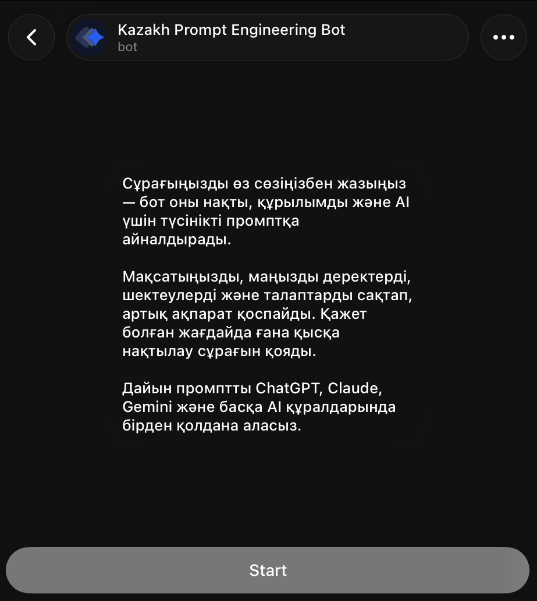

# Telegram user flow

[Home](../README.md) · [Setup](setup.md) · [Architecture](architecture.md) · [Privacy & security](privacy-and-security.md)

The screenshots below document one representative path through the implemented workflow. The example starts with an underspecified business request, triggers a single clarification round, and produces a prompt long enough to use the file-delivery branch.

## 1. Bot profile

  

The profile copy describes the intended experience: users write a request in their own words; the bot returns a structured Kazakh prompt for ChatGPT, Claude, Gemini, or another AI interface. It does not promise to complete the underlying task.

The profile description is configured in Telegram, not by the exported workflow. The export has no dedicated onboarding command: pressing **Start** sends `/start`, which the input gate treats as a command-only message and answers with the generic request-for-text guidance. Users can then send their task normally.

## 2. Request accepted

  

The incoming message is normalized into the workflow's input contract. A temporary status reply confirms that processing started. Empty media, unsupported non-text updates, and command-only messages take the rejection branch instead.

## 3. Focused clarification

  

Here the mapper considers location and target niche material enough to ask. The original request, fidelity map, and question are persisted before the bot returns. The next message starts a separate n8n execution; the answer classifier attaches it to the pending request, marks that state resolved, and skips a second mapping call.

The exact decision to clarify is model-dependent. The workflow permits at most one round and two questions; it does not guarantee that every incomplete request will trigger one.

## 4. Long-prompt delivery

  

After the architect, auditor, and final editor run, the packager measures the final text. This example exceeds the workflow's 3,600-character direct-message threshold, so it becomes a UTF-8 `.txt` document named with the UTC date and source message ID. Shorter prompts are sent directly as Telegram replies.

## Other visible outcomes

Not every branch has a screenshot. The export also implements:

- a Kazakh rejection message for unusable input;
- silent suppression of a duplicated update while the same request is pending;
- cancellation of old clarification state when the next message is a different task;
- a user-visible Kazakh error when the architect produces no usable text;
- best-effort deletion of the temporary status message after handled completion paths.

For the exact routing conditions, see [Architecture](architecture.md). For a test matrix that exercises these paths, see [Setup](setup.md#verification-checklist).
